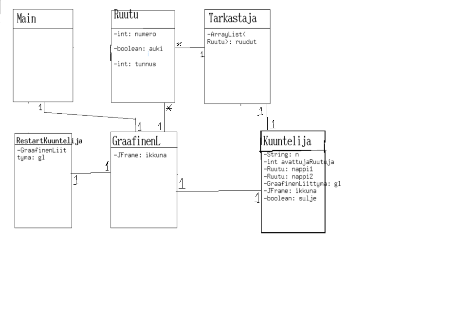

**Aihe** Muistipeli - Graafinen muistipeli. Swingillä toteutetaan ikkuna, joka sisältää nappeja, jotka toimivat muistipelin kortteina, ja sisältävät esim. numeron.

**Käyttäjät:** Kuka tahansa

**Toiminnot** 
Nappeja painamalla saa näkyviin numeron, vain 2 erilaista paritonta nappia voi olla auki samaan aikaan. Kun painetaan 2 nappia joissa on keskenään samat numerot, napit jäävät "auki". Kun kaikki napit on avattu, peli näyttää loppuruudun, jossa on nappi jota painamalla voi aloittaa uuden pelin. Alla vanha kaavio, koska syyt, vaikka sitä ei edes ole koko repossa, klikkaamalla kaaviota pääsee oikeaan kaavioon.

**Rakennekuvaus**
Pelissä on kuusi luokkaa: Main, GraafinenLiittyma, Ruutu, Tarkastaja, Kuuntelija ja RestartKuuntelija, joista "Main" luokka käytännössä vain käynnistää pelin luomalla "GraaninenLiittymä" -luokasta olion ja kutsumalla sen "luoIkkuna()" -metodia.

"GraafinenLiittymä" -luokka koostuu kahdesta metodista: "luoIkkuna()", ja "lisaaNapit(JPanel sisalto)". Pelin pääikkuna JFrame alustetaan "private JFrame ikkuna" -muuttujaan heti kun luokasta luodaan olio.
"luoIkkuna()" luo nimensä mukaisesti pelin näkyvät ikkunat, eli peli-ikkunan ja pelin päätyttyä näytettävän loppu-ikkunan, ja loppu-ikkunaan restart napin. Metodi myös kutsuu luokan toista metodia "lisaaNapit()".
"lisaaNapit()" lisaa ikkunaan "Ruutu" -luokan olioita, jotka toimivat muistipelin kortteina. Luokka jatkaa JButtonia, jolloin nappia painettaessa kaikki tarvittava tieto ruudusta löytyy samasta paikasta actionListenerillä.

Jokaiselle "Ruutu" -oliolle lisätään actionListener joka on luokan "Kuuntelija" -ilmentymä.
Loppuikkunan napilla on oma kuuntelija, "RestartKuuntelija" -luokan ilmentymä, jolla on vain yksi tehtävä, kutsua "GraafinenLiittyma" -luokan metodia "luoIkkuna()" joka tyhjentää nykyisen ikkunan, ja täyttää JFramen uudella pelillä.

"Kuuntelija" -luokka toimii actionListenerinä, ja sille jäi ehkä liikaa tehtäviä, jotka olisi voinut siirtää toiseen luokkaan. Luokka kuuntelee muistipelin ruutuja, ja vertailee avattuja ruutuja ja "avaa" ne, jos ne ovat pari.

"Tarkastaja" -luokassa on yksi metodi "tarkasta()", joka käy läpi kaikki pelin "Ruutu" -oliot ja kutsuu jokaisen "onkoAuki()" -metodia, ja laskee onko aukinaisia ruutuja yhtä paljon kuin ruutuja yhteensä, ja palauttaa sen mukaan true tai false.
